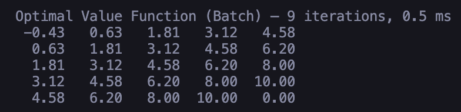
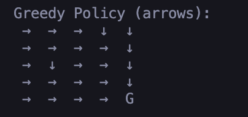
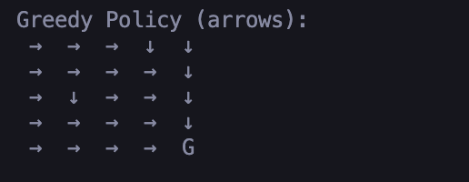
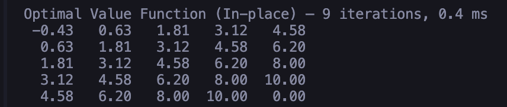

# Problem 3 — Value Iteration on 5×5 Gridworld

## Environment (MDP)

- Grid: 5×5
- Actions: Right, Left, Down, Up (deterministic; bump = stay)
- Rewards:
  - Regular: −1
  - Grey: −5 at (0,4), (2,2), (3,0)
  - Goal (terminal): +10 at (4,4)
- Discount: γ = 0.9

**Files included**

- `gridworld.py` — reward map
- `value_iteration_agent.py` — one-step lookahead and greedy policy
- `value_iteration_solved.py` — Batch and In-Place Value Iteration

---

## Task 1 — Optimal Values and Policy

### Batch (Synchronous) Value Iteration

**Output:**  
Iterations: **9**, Time: **0.4 ms**

**V\***:

- 

**π\*** (greedy policy):

- 

### In-Place (Gauss–Seidel) Value Iteration

**Output:**  
Iterations: **9**, Time: **0.4 ms**

**V\***:

- 

**π\*** (greedy policy):

- 

**Equivalence check:**  
`Max |V_batch - V_inplace| = 0.000e+00` (identical within numerical tolerance)

---

## Task 2 — Value Iteration Variations

Let \(|S|=25\) states and \(|A|=4\) actions.

Per sweep:

- **Bellman backups** (state updates): \(|S| = 25\)
- **Q-evaluations** (one-step lookaheads): \(|S|\times|A| = 25×4 = 100\)

Totals (with your results of **9** iterations for both):

- **Batch:**

  - Sweeps = **9**
  - Backups ≈ **25 × 9 = 225**
  - Q-evaluations ≈ **100 × 9 = 900**

- **In-Place:**
  - Sweeps = **9**
  - Backups ≈ **25 × 9 = 225**
  - Q-evaluations ≈ **100 × 9 = 900**

**Complexity:** Each sweep is \(O(|S||A|)\) for both methods. In-place often needs **fewer sweeps** on larger problems because it reuses freshly updated values within a sweep (faster propagation), but on this 5×5 instance both converged in the same number of sweeps.

**Note on episodes:** Not applicable — Value Iteration is dynamic programming with a known model; it does **not** generate episodes.

---

## Reproducibility

From the `Problem3` folder:

```bash
python value_iteration_solved.py
```
